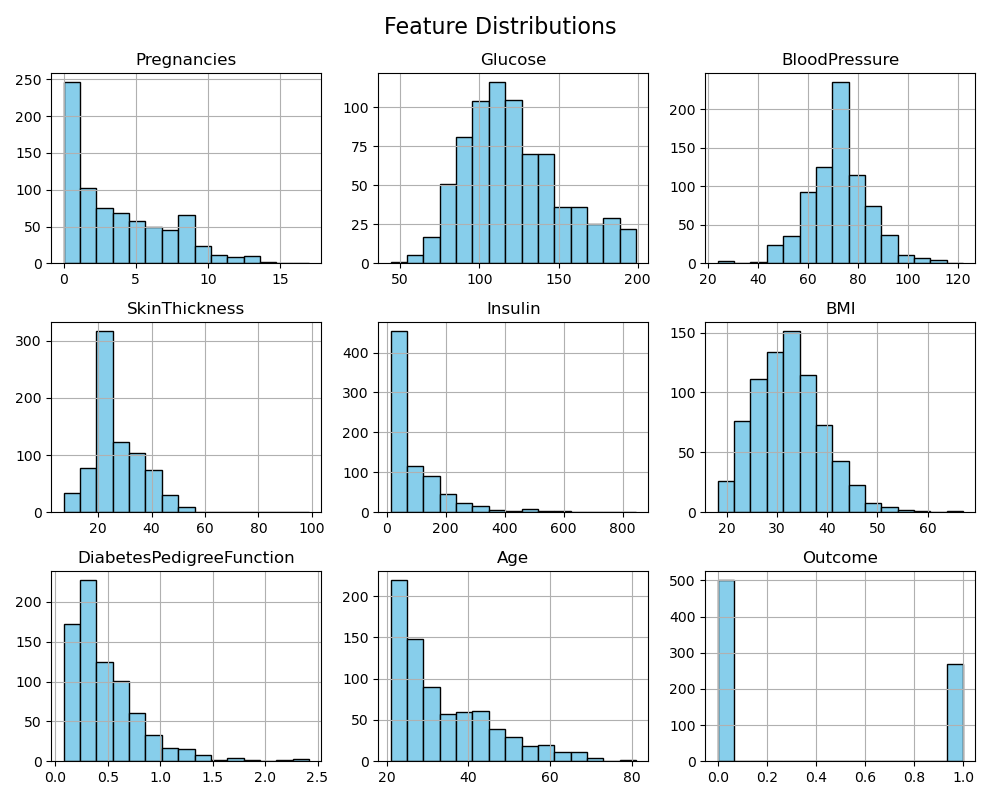
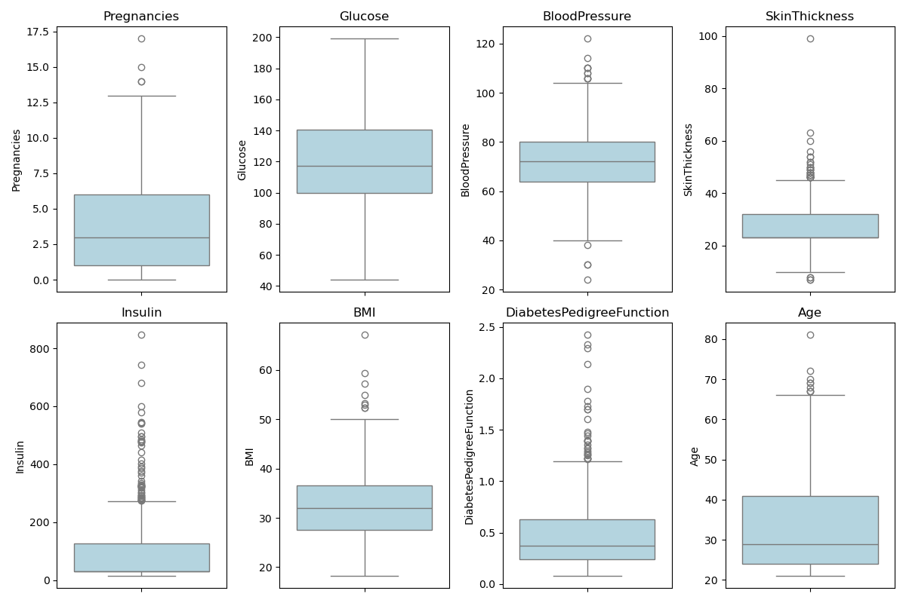
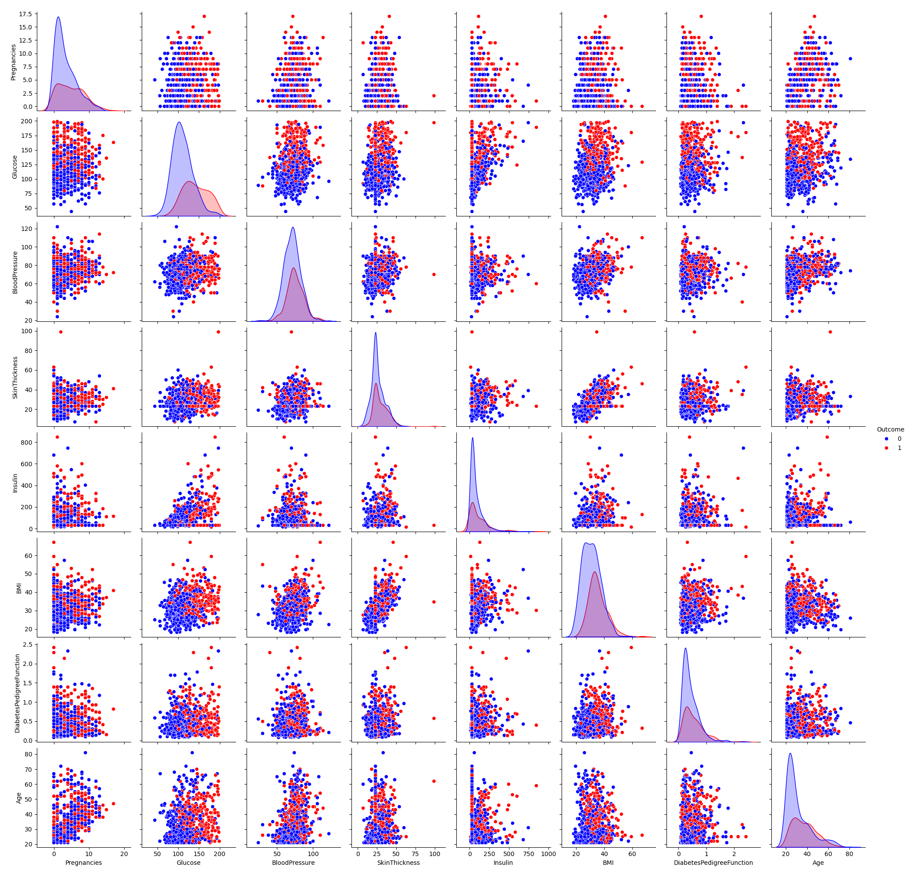
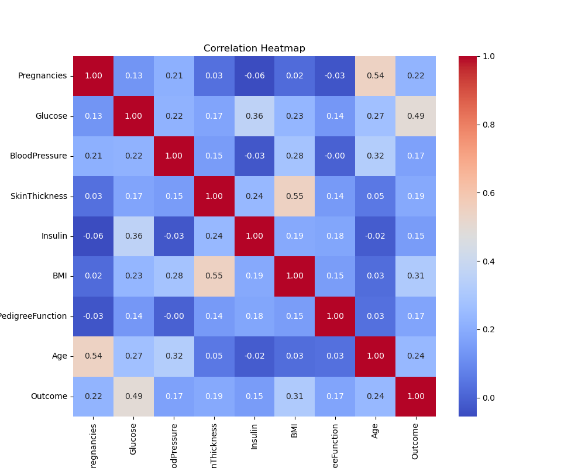

# Data Analyst
# Phân Tích Khám Phá Dữ Liệu Về Bệnh Đái Tháo Đường (Pima Indians Diabetes Dataset)

## Giới thiệu
Bệnh đái tháo đường (ĐTĐ) là rối loạn mạn tính với tăng đường huyết kéo dài, gây tổn thương nhiều cơ quan. Nghiên cứu này dựa trên 3 bài báo chính: NDDG 1979 (phân loại và chẩn đoán đầu tiên), ADAP 1988 (dự báo bằng mạng nơ-ron), và WHO 1999 (cập nhật tiêu chuẩn chẩn đoán). Mục tiêu là phân tích EDA trên dataset Pima Indians Diabetes để xác định yếu tố nguy cơ và hỗ trợ dự báo.

Dataset: 768 instances, 9 features (Pregnancies, Glucose, BloodPressure, SkinThickness, Insulin, BMI, DiabetesPedigreeFunction, Age, Outcome). Outcome: 1 (có bệnh, 34.8%), 0 (không).

## Nội dung Các Bài Nghiên cứu
- **NDDG 1979**: Phân loại IDDM (Type 1), NIDDM (Type 2), IGT, Gestational Diabetes. Tiêu chuẩn: FPG ≥140 mg/dl hoặc OGTT ≥200 mg/dl. Ý nghĩa: Nền tảng cho tiêu chuẩn toàn cầu.
- **ADAP 1988**: Áp dụng mạng nơ-ron ADAP dự báo ĐTĐ type 2 ở phụ nữ Pima Indian trong 5 năm. Input: 8 biến (như Glucose, BMI). Output: Nguy cơ mắc bệnh (Yes/No). Ý nghĩa: Tiên phong học máy trong y tế dự phòng.
- **WHO 1999**: Cập nhật phân loại Type 1/2, IFG/IGT, Metabolic Syndrome. Hạ ngưỡng FPG xuống 126 mg/dl. Ý nghĩa: Tiêu chuẩn hiện đại, nhấn mạnh dự phòng.

## Ý nghĩa Bài toán và Nghiên cứu Liên Quan
- **Input/Output**: Input: Lâm sàng (Glucose, BMI, Age, etc.). Output: Phân loại (Type 1/2, IFG/IGT) hoặc nguy cơ mắc bệnh.
- **Liên quan**: NDDG đặt nền, ADAP áp dụng AI, WHO cập nhật. So sánh với ADA: Hạ ngưỡng chẩn đoán, thêm HbA1c sau. Mở đường cho ML hiện đại (SVM, RF).

## Phân Tích Khám Phá Dữ Liệu (EDA)
### Tổng quan Dataset
- Thống kê: Glucose trung bình 120.85 (max 199), BMI 31.99 (max 67.1), Age 33.2 (max 81).
- Xử lý: Thay 0 (missing) bằng median ở Glucose, BloodPressure, SkinThickness, Insulin, BMI.

### Thống kê Mô tả
- **Phân phối Đặc trưng**: Pregnancies (0-5 phổ biến), Glucose (100-130), BMI (25-35 thừa cân), Age (20-30).
    

- **Biểu đồ Hộp (Boxplots)**: Phát hiện outliers ở Insulin, BMI. Median Glucose ~120, BMI ~32.
    

- **Biểu đồ Cặp (Pairplot)**: Glucose, BMI, Age phân biệt rõ Outcome (1 cao hơn ở đỏ).
    

### Phân tích Tương quan
- Mạnh nhất: Glucose-Outcome (0.47), BMI-Outcome (0.29), Age-Outcome (0.24).
- Yếu: BloodPressure, SkinThickness (~0.07).
    

## Kết luận
Dataset Pima Indians giúp xác định Glucose, BMI, Age là yếu tố nguy cơ chính. Đề xuất: Xử lý nâng cao, xây mô hình ML (Logistic Regression, Neural Networks) để dự báo. Ứng dụng: Hỗ trợ y tế dự phòng, mở rộng dữ liệu đa dạng.

## Hướng dẫn Sử dụng
- **Dependencies**: Pandas, Matplotlib, Seaborn, Scikit-learn.
- **Chạy EDA**: Tải `pima-indians-diabetes.data.csv`, chạy script `eda_script.py`.

Liên hệ: [duyphong204](https://github.com/duyphong204)  
